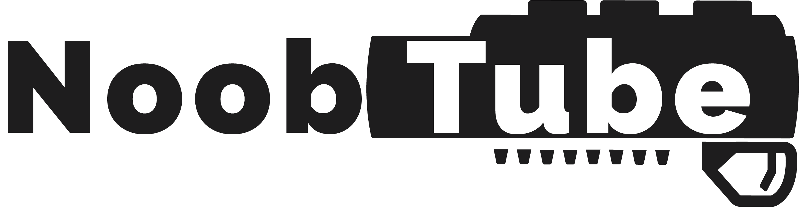

[![Contributors][contributors-shield]][contributors-url]
[![Stargazers][stars-shield]][stars-url]
[![Issues][issues-shield]][issues-url]
[![LinkedIn][linkedin-shield]][linkedin-url-josh]

<br />
<p align="center">
  <a href="https://noobtube-aa.herokuapp.com/">
    
  </a>

  <h3 align="center">Noobtube</h3>

  <p align="center">
    A video platform for gamers
    <br />
    <a href="https://github.com/joshsomthin/noobtube"><strong>Explore the docs »</strong></a>
    <br />
    <br />
    <a href="https://github.com/joshsomthin/noobtube">View Demo</a>
    ·
    <a href="https://github.com/joshsomthin/noobtube/issues">Report a Bug</a>
    ·
    <a href="https://github.com/joshsomthin/noobtube/issues">Request Feature</a>
  </p>
</p>

<!-- TABLE OF CONTENTS -->
<details open="open">
  <summary><h2 style="display: inline-block">Table of Contents</h2></summary>
  <ol>
    <li>
      <a href="#about-the-project">About The Project</a>
      <ul>
        <li><a href="#built-with">Built With</a></li>
      </ul>
    </li>
    <li>
      <a href="#getting-started">Getting Started</a>
      <ul>
        <li><a href="#prerequisites">Prerequisites</a></li>
        <li><a href="#installation">Installation</a></li>
      </ul>
    </li>
    <li><a href="#usage">Usage</a></li>
    <li><a href="#roadmap">Roadmap</a></li>
    <li><a href="#contributing">Contributing</a></li>
    <li><a href="#license">License</a></li>
    <li><a href="#contact">Contact</a></li>
    <li><a href="#acknowledgements">Acknowledgements</a></li>
  </ol>
</details>

<!-- ABOUT THE PROJECT -->

## About The Project

<a href="https://noobtube-aa.herokuapp.com/">
  
</a>

## Summary

Noobtube is a web application inspired by YouTube built using Python / Flask utilizing React.js/Redux architecture. Noobtube allows users to:

- Create an account / profile
- Log in / Log out
- Watch videos
- Subscribe to channels
- Comment on videos
- Search for videos of video games

### Built With

- [Javascript](https://www.javascript.com/)
- [React](https://reactjs.org/)
- [Redux](https://redux.js.org/)
- [Python](https://www.python.org/)
- [Flask](https://flask.palletsprojects.com/en/1.1.x/)
- [SQLAlchemy](https://www.sqlalchemy.org/)
- [PostgreSQL](https://www.postgresql.org/)
- [CSS](https://developer.mozilla.org/en-US/docs/Web/CSS)
- [react-responsive-carousel](https://www.npmjs.com/package/react-responsive-carousel)

## Overall Structure

#### Back end

The app was built using Python / Flask on the back end with a postgreSQL database. Back end structure is RESTful and all the data requests use AJAX and are fulfilled with a JSON API. Associations are used to prefetch data in order to minimize SQL queries to the database.

#### Front end

The front end is built completely in React / JavaScript and utilizes Redux for global state management. React's virtual DOM allows for very fast rerendering without requiring new pages to be sent from the server. Even modals appear/disappear using React rather than toggling CSS display properties.

<!-- GETTING STARTED -->

## Getting Started

To get a local copy up and running follow these simple steps.

### Prerequisites

Installations

- npm

  ```sh
  npm install npm@latest -g
  ```

- pipenv

  ```sh
  pipenv install
  ```

### Installation

1. Clone the repository

   ```sh
   git clone https://github.com/joshsomthin/noobtube.git

   ```

2. Install Pipenv dependencies

   ```sh
   pipenv install --dev -r dev-requirements.txt && pipenv install -r requirements.txt
   ```

3. Create a **.env** file based on the example with proper settings for your
   development environment
4. Setup your PostgreSQL user, password and database and make sure it matches your **.env** file

5. Get into your pipenv, migrate your database, seed your database, and run your flask app

   ```bash
   pipenv shell
   ```

   ```bash
   flask db upgrade
   ```

   ```bash
   flask seed all
   ```

   ```bash
   flask run
   ```

6. Install NPM packages - cd into react-app

   ```sh
   npm install
   ```

7. While still in the react-app folder
   ```sh
   npm start
   ```

## Primary Components

### User Authorization

User authentication is handled in Flask using the flask_login package. The werkzeug.security package is used for password hashing. Passwords are not saved to the database, only password hashes. When users log in, the password they provide is rehashed and checked against the original encrypted password hash to verify credentials.

![signin]

### Home Page

The Noobtube homepage features sliding carousels of games sorted by genre. These carousels include the top games for each genre. All game links will create a request to a YouTube API to fill results from that game.

![homepage]

### Video Page

On navigation to the video page, if the specified video is not already present in the database, a fetch request will be made to the backend which will add it to the database for future queries. This information, such as the video's channel, user, and comments will be rendered extremely quickly thanks to React's virtual DOM. A logged in user can interact with the video page by commenting on it, subscribing to it, adding/deleting comments and of course playing/pausing the video, with page updates happening instantly, the view count increments at the end of a video being watched. All of the updated video data is saved to the postgreSQL database where it can be retreived later on.

![videopage]

### Search Results

When a user enters something into the searchbar, a fetch request is sent to the backend where it makes two requests. The first request is to the RAWG API to see if there are any video games in their database that match the query. The second is sent to the postgreql database and then the two are compared and matched. If there are duplicate entries they are removed, and all the new entries are now saved in the database for future queries. The backend responds with results for matching video games, which is then rendered on the search results page with the appropriate images/navigation links.

![search_results]

### Subscriptions

As a logged in user, you are able to subscribe to channels. When you subscribe to a channel, the database will return all the videos that user has uploaded and been viewed/placed in the database and return them to the user in their subscription box. As it works right now, a video isn't registered into the database until a user visits the video. In the future it will be implemented to seed a variety of new videos by the channel, so users will be able to view new videos by the creator in addition to already seeded ones that have been viewed.

![subscriptions]

<!-- ROADMAP -->

## Roadmap

See the [open issues](https://github.com/joshsomthin/noobtube/issues) for a list of proposed features (and known issues).

<!-- CONTRIBUTING -->

## Contributing

Contributions are what make the open source community such an amazing place to be learn, inspire, and create. Any contributions you make are **greatly appreciated**.

1. Fork the Project
2. Create your Feature Branch (`git checkout -b feature/AmazingFeature`)
3. Commit your Changes (`git commit -m 'Add some AmazingFeature'`)
4. Push to the Branch (`git push origin feature/AmazingFeature`)
5. Open a Pull Request

<!-- LICENSE -->

## License

Distributed under the GNU License. See `LICENSE` for more information.

<!-- CONTACT -->

## Contact

Josh - joshua.miller2289@gmail.com

Project Link: [https://noobtube-aa.herokuapp.com/](https://noobtube-aa.herokuapp.com/)

<!-- ACKNOWLEDGEMENTS -->

## Acknowledgements

- [App Academy](https://www.appacademy.io/)

<!-- MARKDOWN LINKS & IMAGES -->
<!-- https://www.markdownguide.org/basic-syntax/#reference-style-links -->

[signin]: https://i.gyazo.com/c0c79e2a0be40e1929fc9eb07e2cd1aa.jpg
[homepage]: https://i.gyazo.com/c17df3315c9dcb13538cb015d873ca1f.jpg
[videopage]: https://i.gyazo.com/cf506e54be513181c2a8d37137e3d06a.jpg
[search_results]: https://i.gyazo.com/0b1751ad8ce602ce56501ceed9a0ae05.jpg
[subscriptions]: https://i.gyazo.com/1c22fb497d9dd03e279a80e314de2395.jpg
[contributors-shield]: https://img.shields.io/github/contributors/joshsomthin/noobtube.svg?style=for-the-badge
[contributors-url]: https://github.com/joshsomthin/noobtube/graphs/contributors
[forks-shield]: https://img.shields.io/github/forks/joshsomthin/noobtube?style=social
[forks-url]: https://github.com/joshsomthin/noobtube/network/members
[stars-shield]: https://img.shields.io/github/stars/joshsomthin/noobtube.svg?style=for-the-badge
[stars-url]: https://github.com/joshsomthin/noobtube/stargazers
[issues-shield]: https://img.shields.io/github/issues/joshsomthin/noobtube.svg?style=for-the-badge
[issues-url]: https://github.com/joshsomthin/noobtube/issues
[license-shield]: https://img.shields.io/badge/License-GPL%20v3-blue.svg
[license-url]: https://github.com/joshsomthin/noobtube/blob/main/LICENSE
[linkedin-shield]: https://img.shields.io/badge/-LinkedIn-black.svg?style=for-the-badge&logo=linkedin&colorB=555
[linkedin-url-josh]: https://www.linkedin.com/in/joshua-miller-625685154/
[product-screenshot]: images/screenshot.png
